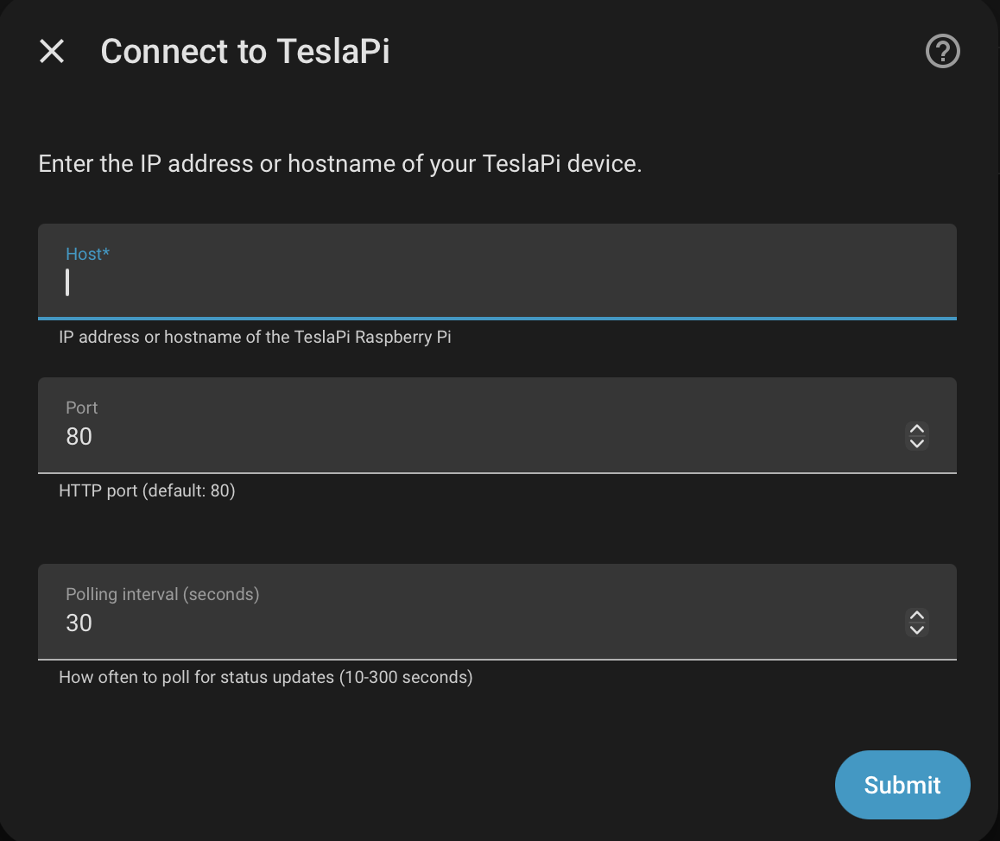
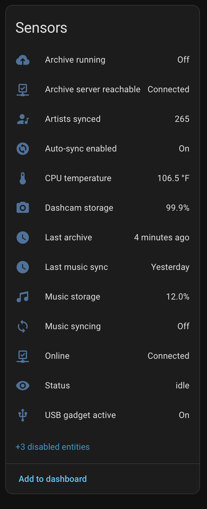
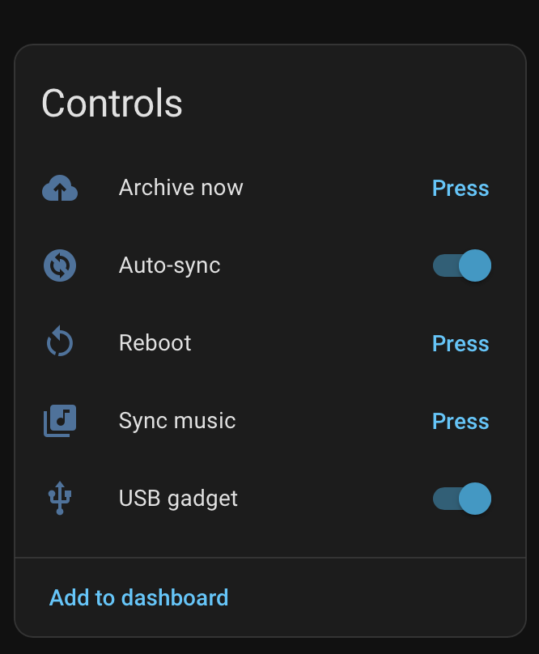

# TeslaPi Home Assistant Integration

[](https://github.com/hacs/integration)

A Home Assistant custom component for [TeslaPi](https://github.com/nickpdawson/TeslaPi) — the modern Raspberry Pi USB drive system for Tesla vehicles.

Monitor your TeslaPi device, trigger dashcam archives and music syncs, browse archived dashcam clips, and control the USB gadget — all from Home Assistant.

| Setup | Sensors | Controls |
|-------|---------|----------|
|  |  |  |

## Features

- **21 entities** — sensors, binary sensors, buttons, and switches
- **4 services** — call from automations with full parameter control
- **Media browser** — browse and play archived dashcam clips from the HA Media panel
- **Config flow** — UI-based setup with connection validation
- **Options flow** — change polling interval without reconfiguring
- **Multi-device** — support for multiple TeslaPi devices
- **Translations** — full English translation support

## Requirements

- Home Assistant 2024.1.0 or newer
- A [TeslaPi](https://github.com/nickpdawson/TeslaPi) device on your network with the API running

## Installation

### HACS (Recommended)

1. Open HACS in Home Assistant
2. Click the three dots in the top right and select **Custom repositories**
3. Add `https://github.com/nickpdawson/TeslaPi_HACS` with category **Integration**
4. Search for **TeslaPi** and install
5. Restart Home Assistant

### Manual

1. Download the `custom_components/teslapi` folder from this repository
2. Copy it to your Home Assistant `config/custom_components/` directory
3. Restart Home Assistant

## Setup

1. Go to **Settings > Devices & Services > Add Integration**
2. Search for **TeslaPi**
3. Enter the IP address or hostname of your TeslaPi device
4. Optionally adjust the port (default: 80) and polling interval (default: 30 seconds)

## Entities

### Sensors

| Entity | Description |
|--------|-------------|
| Status | Overall state: idle, connected, archiving, syncing, error, offline |
| CPU temperature | Raspberry Pi CPU temperature |
| Dashcam storage | Dashcam drive usage percentage |
| Music storage | Music drive usage percentage |
| Last archive | Timestamp of the last completed archive |
| Last music sync | Timestamp of the last completed music sync |
| Artists synced | Number of artists on the Tesla USB drive |
| WiFi signal | WiFi signal strength in dBm (disabled by default) |
| Uptime | Device uptime (disabled by default) |
| RAM usage | RAM usage in MB (disabled by default) |

### Binary Sensors

| Entity | Description |
|--------|-------------|
| Online | Device is reachable |
| USB gadget active | USB drives are presented to the Tesla |
| Archive running | A dashcam archive job is in progress |
| Music syncing | A music sync job is in progress |
| Archive server reachable | The NAS/archive server is reachable |
| Auto-sync enabled | Background auto-sync is enabled |

### Buttons

| Entity | Description |
|--------|-------------|
| Archive now | Trigger a dashcam archive |
| Sync music | Trigger a full music sync |
| Reboot | Reboot the Raspberry Pi |

### Switches

| Entity | Description |
|--------|-------------|
| USB gadget | Enable/disable the USB mass storage gadget |
| Auto-sync | Enable/disable automatic dashcam archiving |

## Services

### `teslapi.start_archive`

Start a dashcam archive job.

| Parameter | Type | Default | Description |
|-----------|------|---------|-------------|
| `trigger` | string | `ha` | Trigger source: `ha` or `manual` |
| `delete_after` | boolean | `false` | Delete clips from dashcam after archiving |

### `teslapi.cancel_archive`

Cancel the currently running archive job.

### `teslapi.start_music_sync`

Start a music sync job.

| Parameter | Type | Default | Description |
|-----------|------|---------|-------------|
| `mode` | string | `full` | Sync mode: `full`, `selected`, `random`, or `recent` |
| `paths` | list | — | Artist/album paths to sync (for `selected` mode) |
| `count` | integer | `20` | Number of items (for `random`/`recent` modes) |
| `type` | string | `artist` | Item type for random mode: `artist` or `album` |

### `teslapi.cancel_music_sync`

Cancel the currently running music sync job.

## Media Browser

Browse archived dashcam clips from **Media > TeslaPi Dashcam** in the HA sidebar.

Clips are organized by event type (Sentry, Saved, Recent), then by event timestamp, with individual camera angles (Front, Back, Left/Right Repeater, Left/Right Pillar) as playable items.

## Example Automations

### Archive dashcam when the car arrives home

```yaml
automation:
  - alias: "Archive dashcam on arrival"
    trigger:
      - platform: state
        entity_id: device_tracker.tesla
        to: "home"
        for: "00:05:00"
    condition:
      - condition: state
        entity_id: binary_sensor.teslapi_server_reachable
        state: "on"
    action:
      - service: teslapi.start_archive
        data:
          trigger: ha
```

### Notify on low dashcam storage

```yaml
automation:
  - alias: "TeslaPi dashcam storage warning"
    trigger:
      - platform: numeric_state
        entity_id: sensor.teslapi_dashcam_storage
        above: 90
    action:
      - service: notify.mobile_app
        data:
          title: "TeslaPi Storage Warning"
          message: "Dashcam drive is {{ states('sensor.teslapi_dashcam_storage') }}% full"
```

## License

MIT

## Links

- [TeslaPi](https://github.com/nickpdawson/TeslaPi) — the main TeslaPi project
- [TeslaPi API Reference](https://github.com/nickpdawson/TeslaPi/blob/main/teslapi_api.md) — full API documentation
